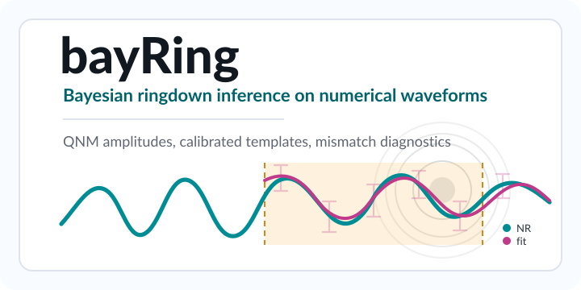

.. bayRing documentation master file.

bayRing
=======

``bayRing`` is a Bayesian inference package for ringdown modelling of
numerical-relativity waveforms. It targets mode-by-mode studies of numerical
relativity data, supporting agnostic damped sinusoids, Kerr QNM superpositions,
and numerically calibrated ``KerrBinary`` and ``KerrPostmerger`` templates. It
supports a variety of inference techniques: simple solvers via minimization or
inversion for linear parameters, nested sampling, and mismatch/SNR diagnostics,
incorporating time-dependent numerical relativity uncertainties.

.. raw:: html

   

     <a href="introduction.html">Introduction</a>
     <a href="install_and_run.html">Install</a>
     <a href="tutorials.html">Examples</a>
     <a href="waveform_models.html">Waveforms</a>
     <a href="nr_data.html">NR data</a>
     <a href="inference_methods.html">Inference</a>
   

.. toctree::
   :maxdepth: 1
   :caption: Start here:

   introduction
   install_and_run
   tutorials

.. toctree::
   :maxdepth: 2
   :titlesonly:
   :caption: Modelling & Inference:

   nr_data
   waveform_models
   inference_methods
   configuration_reference
   mismatch_snr

.. toctree::
   :maxdepth: 1
   :caption: Diagnostics & Development:

   outputs_diagnostics
   contributing
   modules

Indices & Tables
----------------

* :ref:`genindex`
* :ref:`modindex`
* :ref:`search`
