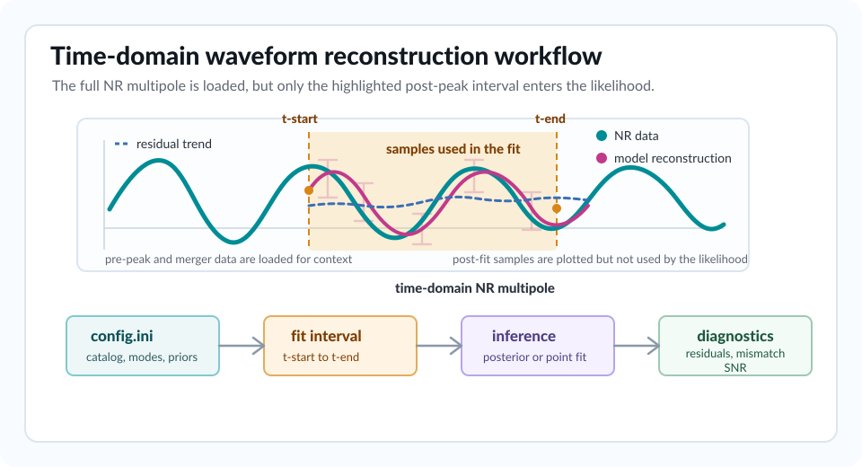

Introduction
------------

``bayRing`` is a Python package for fitting analytical ringdown models to
numerical-relativity waveforms. The core use case is the extraction,
comparison and validation of ringdown model parameters on NR simulations, with
the same QNM conventions and waveform infrastructure used by ``pyRing``.

The package depends on:

* **Waveform infrastructure:** ``pyRing`` provides waveform interfaces and
  shared ringdown utilities, and the ``hm_nc_fit`` branch of ``pyRing`` should
  be installed to use ``bayRing``.
* **QNM spectra:** ``qnm`` provides Kerr QNM frequencies and damping times.
* **Nested sampling:** ``cpnest`` and ``raynest`` provide sampling backends.
* **Point estimates:** ``scipy.optimize.least_squares`` provides the
  minimization backend, and the linear-inversion solver provides direct Kerr
  amplitude estimates.
* **Catalogue readers:** SXS, RIT, Teukolsky, cbhdb, C2EFT and related data
  formats are handled by catalogue-specific readers.

What bayRing Fits
~~~~~~~~~~~~~~~~~

``bayRing`` fits:

* **NR multipole:** a single complex NR multipole at a time.
* **Waveform components:** against real and imaginary waveform components on
  the NR time grid.
* **Fit interval:** a cropped time interval between ``t-start`` and ``t-end``
  in units of the total mass ``M``.
* **Uncertainty model:** model residuals weighted by the selected NR error
  estimate.

The fitted data vector is

.. container:: key-equation

   .. math::

      h_{\ell m}^{\mathrm{NR}}(t)
      = h_{\ell m}^{\mathrm{R}}(t) + i h_{\ell m}^{\mathrm{I}}(t).

The crop is usually measured relative to the peak of the selected waveform
amplitude. The model predicts the same complex multipole on the same time
grid.

This makes ``bayRing`` useful for:

* **QNM amplitudes:** estimate amplitudes and phases in a chosen NR multipole.
* **Ringdown start studies:** test when constant-amplitude QNM superpositions
  describe a simulation over a selected time interval.
* **Template comparisons:** compare ``Kerr``, ``Damped-sinusoids``,
  ``KerrBinary`` and ``TEOBPM`` templates.
* **Higher modes:** study higher multipoles and spherical-spheroidal
  mode-mixing effects.
* **Nonlinear and non-QNM ringdown content:** validate second-order QNM
  contributions and late-time tail terms.
* **Waveform quality checks:** compute mismatches and detector-scaled optimal
  SNR diagnostics.

Workflow At A Glance
~~~~~~~~~~~~~~~~~~~~

The figure below shows the main workflow for a time-domain NR fit. The shaded
region is the only part of the loaded waveform that enters the likelihood.
The rest of the waveform is still useful context for peak finding,
post-processing and visual diagnostics.

