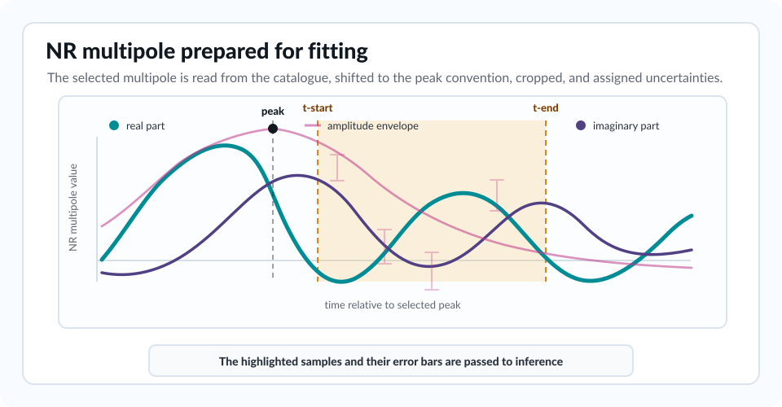
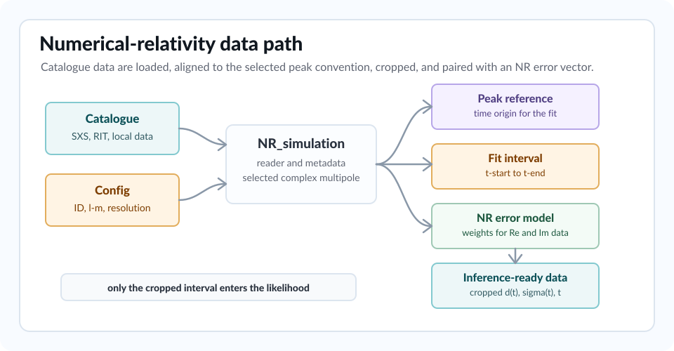

Numerical-Relativity Data
-------------------------

``bayRing`` fits one complex NR multipole at a time. The ``[NR-data]`` section
selects the catalogue, simulation, resolution, waveform type, fitted
multipole, local paths and NR error prescription.

   The catalogue reader keeps the full multipole available for context, while
   inference uses only the highlighted interval and the corresponding error
   vector.

Catalogue Selection
~~~~~~~~~~~~~~~~~~~

The primary option is:

.. code-block:: ini

   [NR-data]
   catalog = SXS
   ID = 0305

Supported catalogue names in the current parser are:

.. list-table::
   :header-rows: 1
   :widths: 18 24 48

   * - ``catalog``
     - Typical data source
     - Notes
   * - ``SXS``
     - Simulating eXtreme Spacetimes catalog
     - Default catalogue. ``download = 1`` asks the SXS tooling to fetch the
       simulation when needed.
   * - ``RIT``
     - RIT numerical-relativity catalogue
     - Uses local RIT waveform/metadata paths, with download attempts for some
       missing RIT files.
   * - ``Teukolsky``
     - Local Teukolsky perturbation data
     - Not public NR data. Supports named resolution levels or explicit
       ``res-nx``/``res-nl``.
   * - ``RWZ-env``
     - Regge-Wheeler-Zerilli environmental simulations
     - Not public NR data. Supports simple ``HplusHcrossLMlm.dat`` files and
       resolution/extrapolation files named ``HplusHcrossLMlmRL*EP*.dat``.
   * - ``C2EFT``
     - Local C2EFT data
     - Not public NR data. Some resolution/extrapolation choices are currently
       hard-coded in the reader.
   * - ``cbhdb``
     - Charged black-hole database
     - Not public NR data. Uses the ``cbhdb`` Python interface and charged QNM
       metadata.
   * - ``charged_raw``
     - Local raw charged-waveform files
     - Reads raw ``times`` and ``cross`` files from ``NR-data dir``.
   * - ``injections``
     - Internal synthetic data
     - Builds an injection waveform from the selected template and supplied
       injection parameters.

The default catalogue is ``SXS`` and the default simulation ID is ``0305``.

Synthetic Template Injections
~~~~~~~~~~~~~~~~~~~~~~~~~~~~~

For ``catalog = injections``, the ``[Injection-data] parameters`` dictionary
defines the synthetic waveform.  It must include ``t_start``, ``t_end``,
``dt`` and either ``q`` or both ``m1`` and ``m2``.  Kerr-like templates
(``Damped-sinusoids``, ``Kerr`` and ``Kerr-Damped-sinusoids``) also require
``Mf`` and ``af``.  NR-informed templates (``KerrBinary`` and ``TEOBPM``)
derive ``Mf`` and ``af`` from the binary parameters through the same remnant
fits used by pyRing injections, so those entries must not be supplied
independently.

The remaining entries use the same parameter names as the selected
``[Model] template``.  For example, ``Damped-sinusoids`` accepts names such as
``ln_A_0``, ``phi_0``, ``f_0`` and ``tau_0``; ``KerrBinary`` accepts ``phi``;
and ``TEOBPM`` accepts ``phi_mrg_22`` plus local fit coefficients when global
fits are disabled.

Local Data Paths
~~~~~~~~~~~~~~~~

``dir`` points to catalogue data when the selected backend needs local files:

.. code-block:: ini

   [NR-data]
   dir = /path/to/local/catalog/data

If an option needs data outside the installed package and the path is not
explicitly supplied, ``bayRing`` can fall back to ``BAYRING_PREFIX`` for
repository-relative data layouts. Set:

.. code-block:: bash

   export BAYRING_PREFIX=/path/to/bayRing

Optional metadata tables use:

.. code-block:: ini

   [NR-data]
   properties-file = /path/to/properties.csv
   fits-file = /path/to/fits.csv

``properties-file`` supplies supplemental NR quantities such as Carullo2024
metadata variables. TEOBPM merger peak quantities are computed from the loaded
NR waveform when ``TEOB-merger-data = 1``; a properties table can still provide
precomputed values for legacy runs. ``fits-file`` supplies fit coefficients for
calibrated templates such as some ``TEOBPM`` workflows. Empty strings are
treated as no file supplied.

Multipole Selection
~~~~~~~~~~~~~~~~~~~

The fitted NR multipole is set with:

.. code-block:: ini

   [NR-data]
   l-NR = 2
   m = 2

The selected ``(l-NR, m)`` is the spherical-harmonic multipole read from the NR
data. It does not force every model QNM to have the same ``l``. In the Kerr
template, multiple spheroidal QNMs with the same azimuthal index can contribute
to the selected spherical multipole.

Several NR multipoles can be fitted from one configuration. Either pass paired
lists to ``l-NR`` and ``m``:

.. code-block:: ini

   [NR-data]
   l-NR = 2,3,4
   m = 2,3,4

or pass explicit pairs with ``NR-modes``:

.. code-block:: ini

   [NR-data]
   NR-modes = [(2,2),(3,3),(4,4)]

Compact mode tokens such as ``NR-modes = 22,33,4-4`` are also accepted. When
several modes are supplied, bayRing repeats the analysis for each mode and
writes mode-dependent products below ``outdir/mode_l<l>_m<m>/``. Set
``n-mode-workers`` in ``[Inference]`` to run multiple mode fits concurrently.
Multi-mode scans also write a summed higher-mode mismatch under
``outdir/HM_sum/Algorithm/Mismatch/``. Its inclination grid is controlled by
``[Mismatch-GW-parameters] inclination``; its polarisation treatment defaults to
the marginalised ``polarisation = 0:3*pi/4:pi/4`` grid, or to one fixed angle if
``polarisation`` is set to a scalar.

For informed-amplitude fits using the ``(2,2)`` peak time as reference, provide
the time of the ``(2,2)`` peak:

.. code-block:: ini

   [NR-data]
   l-NR = 3
   m = 3
   t-peak-22 = 3800.6154428984305

Time Axis And Fit Window
~~~~~~~~~~~~~~~~~~~~~~~~

After the waveform is loaded, ``bayRing`` computes the amplitude and phase of
the complex NR multipole. It then finds a peak time:

* for non-eccentric or very high-eccentricity waveforms, the peak is the
  maximum amplitude sample;
* for eccentric waveforms with ``1e-3 < ecc < 0.89``, the code tries to use
  the last relative amplitude maximum;
* for Teukolsky linear perturbations, ``dt-scd`` can shift the peak to a
  secondary reference time;
* a nonzero ``t-peak-22`` overrides those choices.

The TEOBPM calibration workflow uses the ``(2,2)`` peak as the reference time.
For each loaded NR multipole, bayRing computes the merger amplitude, merger
frequency, peak-time offset ``DeltaT_lm`` and peak-amplitude second derivative
directly from the NR waveform. Generated local-fit configs therefore start from
the configured ``t-start`` without evaluating pyRing's built-in ``DeltaT_lm``
fits. Evaluation mismatch comparisons for local-fit plots and global-fit checks
should start from the ``(2,2)`` peak with ``t-start = 0`` and ``tref = peak22``;
higher modes can be zero until their computed ``DeltaT_lm`` start.

The fit interval is:

.. container:: key-equation

   .. math::

      t_{\min} = t_{\mathrm{peak}} + t\mbox{-start},\qquad
      t_{\max} = t_{\mathrm{peak}} + t\mbox{-end}.

These values are set in the ``[Inference]`` section:

.. code-block:: ini

   [Inference]
   t-start = 20.0
   t-end = 140.0

The code crops the NR waveform, error vector and time array to this interval
before inference.

Waveform Type
~~~~~~~~~~~~~

``waveform-type`` selects which waveform quantity is read where the backend
supports multiple choices:

.. code-block:: ini

   [NR-data]
   waveform-type = strain

The default is ``strain``. Some catalogue paths can also handle ``psi4``.
Make sure the selected model and post-processing interpretation match the
quantity being fitted.

Resolution And Extrapolation
~~~~~~~~~~~~~~~~~~~~~~~~~~~~

The main resolution options are:

.. list-table::
   :header-rows: 1
   :widths: 24 56

   * - Option
     - Meaning
   * - ``res-level``
     - Catalogue resolution level. For SXS and RWZ ``RL`` files, ``-1``
       selects the highest available resolution found by the reader.
   * - ``extrap-order``
     - SXS extrapolation order. The default is ``2``.
   * - ``res-nx`` and ``res-nl``
     - Teukolsky radial and angular collocation counts. When both are nonzero,
       they override ``res-level`` and form a resolution string such as
       ``nx_190_nl_24``.
   * - ``pert-order``
     - Teukolsky perturbation order, usually ``lin`` or ``scd``.

For Teukolsky data, integer ``res-level`` values map to specific
``nx``/``nl`` pairs in ``convert_resolution_level_Teukolsky``. Explicit
``res-nx`` and ``res-nl`` are useful when the desired resolution is not one of
the named levels.

NR Error Prescriptions
~~~~~~~~~~~~~~~~~~~~~~

The likelihood compares real and imaginary residuals against the complex error
vector. The real part of the error weights the real residual; the imaginary
part weights the imaginary residual.

The simplest error is a constant:

.. code-block:: ini

   [NR-data]
   error = constant-0.0001

This generates a complex error with real and imaginary components both equal
to ``0.0001`` at every time sample.

Catalogue-dependent options include:

.. list-table::
   :header-rows: 1
   :widths: 22 58

   * - Option
     - Behaviour
   * - ``constant-X``
     - Use the constant error value ``X`` for both real and imaginary parts.
   * - ``late-time-const-error``
     - Use the catalogue metadata value ``A_nr_error`` where available.
   * - ``align-with-mismatch-res-only``
     - For SXS-like resolution comparisons, align the lower-resolution
       waveform by minimizing mismatch and use the resolution difference.
   * - ``align-with-mismatch-all``
     - For SXS-like data, include both resolution and extrapolation
       differences after mismatch alignment.
   * - ``align-at-peak``
     - Align comparison waveforms at the amplitude peak rather than through a
       mismatch minimization.
   * - ``resolution``
     - For Teukolsky data, compare against another resolution level when
       available. For ``RWZ-env``, compare against the next lower available
       ``RL`` file.
   * - ``gaussian-X``
     - For ``injections``, set a Gaussian-noise scale ``X``.
   * - ``from-SXS-NR``
     - For ``injections``, reuse the SXS-derived error vector.

Mismatch-alignment options use:

.. code-block:: ini

   [NR-data]
   error-t-min = 0.0
   error-t-max = 30.0

The default values align over ``[0,30]M`` after the peak. When both values are
in ``[0,1]``, the implementation keeps the legacy fractional pre-peak
convention:

.. math::

   t_{\min}^{\mathrm{mm}} = t_{\mathrm{peak}}(1 - \mathrm{error\mbox{-}t\mbox{-}min}),
   \qquad
   t_{\max}^{\mathrm{mm}} = t_{\mathrm{peak}}(1 - \mathrm{error\mbox{-}t\mbox{-}max}).

Otherwise the values are interpreted as offsets from the peak time:

.. math::

   t_{\min}^{\mathrm{mm}} = t_{\mathrm{peak}} + \mathrm{error\mbox{-}t\mbox{-}min},
   \qquad
   t_{\max}^{\mathrm{mm}} = t_{\mathrm{peak}} + \mathrm{error\mbox{-}t\mbox{-}max}.
