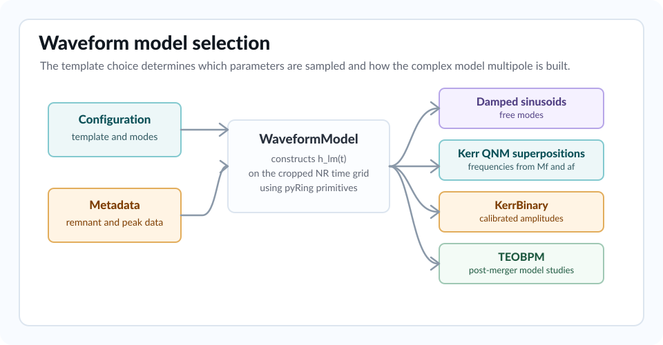

Waveform Models
---------------

The waveform model is selected with:

.. code-block:: ini

   [Model]
   template = Kerr

The model is evaluated on the cropped NR time array. It returns a complex
waveform whose real and imaginary parts are compared directly to the selected
NR multipole.

For an introduction to the models used, see the `pyRing waveforms page
<https://lscsoft.docs.ligo.org/pyring/#ringdown-models>`_.

Model Selection Summary
~~~~~~~~~~~~~~~~~~~~~~~

.. list-table::
   :header-rows: 1
   :widths: 24 28 38

   * - Template
     - Main free parameters
     - Typical use
   * - ``Damped-sinusoids``
     - Free amplitudes, phases, frequencies and damping times.
     - Agnostic checks when QNM frequencies should not be imposed.
   * - ``Kerr``
     - Kerr QNM amplitudes and phases, with frequencies fixed by ``Mf`` and
       ``af``.
     - Ringdown spectroscopy on NR multipoles.
   * - ``Kerr-Damped-sinusoids``
     - Kerr QNM amplitudes plus additional free damped sinusoids.
     - Residual modelling and robustness studies.
   * - ``KerrBinary``
     - Numerically calibrated QNM amplitudes superpositions.
     - NR-calibrated ringdown comparisons.
   * - ``TEOBPM``
     - Merger phase, and optionally NR calibration coefficients.
     - Post-merger model studies.

Damped Sinusoids
~~~~~~~~~~~~~~~~

``Damped-sinusoids`` uses a superposition of ``N`` damped sinusoids, with
parameters:

.. code-block:: text

   ln_A_j
   phi_j
   f_j
   tau_j

Use:

.. code-block:: ini

   [Model]
   template = Damped-sinusoids
   N-DS-modes = 1

The default bounds are:

.. list-table::
   :header-rows: 1
   :widths: 20 25

   * - Parameter base name
     - Default bound
   * - ``ln_A``
     - ``[-20.0, 5.0]``
   * - ``phi``
     - ``[0.0, 2*pi]``
   * - ``f``
     - ``[-2/(2*pi), 2/(2*pi)]``
   * - ``tau``
     - ``[1, 50]``

The prior enforces ordered frequencies for damped sinusoids. If
``f_i < f_{i-1}``, the nested-sampler prior is zero and the minimization path
adds a penalty residual.

Set ``N-DS-tails`` to add tail factors to ``Damped-sinusoids``.
Tail parameters are named ``ln_A_tail_j``, ``phi_tail_j`` and ``p_tail_j``;
their default bounds are ``[-20, 5]``, ``[0, 2*pi]`` and ``[-10, 3]``.

Kerr QNM Template
~~~~~~~~~~~~~~~~~

``Kerr`` uses the remnant mass ``Mf`` and spin ``af`` from NR metadata to
compute QNM frequencies and damping times. A linear mode is requested as
``lmn``:

.. code-block:: ini

   [Model]
   template = Kerr
   QNM-modes = 220,221,320

For a selected mode ``(l,m,n)``, the sampled parameters are:

.. code-block:: text

   ln_A_lmn
   phi_lmn

The complex amplitude is:

.. math::

   A_{\ell m n}^{\mathbb{C}} =
   \exp(\ln A_{\ell m n})\,e^{i\phi_{\ell m n}}.

``bayRing`` passes these amplitudes into ``pyRing.waveform.KerrBH`` with
geometric normalization, cached QNM frequencies and the NR peak time as
reference time.

The default Kerr bounds are:

.. list-table::
   :header-rows: 1
   :widths: 20 25

   * - Parameter base name
     - Default bound
   * - ``ln_A``
     - ``[-20.0, 5.0]``
   * - ``phi``
     - ``[0.0, 2*pi]``

QNM Frequencies
^^^^^^^^^^^^^^^

For uncharged catalogues, frequencies and damping times are computed through
``qnm.modes_cache``:

.. math::

   f_{\ell m n} =
   \frac{\mathrm{Re}[\omega_{\ell m n}(a_f)]}{2\pi M_f},
   \qquad
   \tau_{\ell m n} =
   -\frac{M_f}{\mathrm{Im}[\omega_{\ell m n}(a_f)]}.

For charged catalogues, ``qf`` is read from the metadata and pyRing's
Kerr-Newman interpolation utilities are used.

Negative m Modes
^^^^^^^^^^^^^^^^

Negative ``m`` is encoded directly in the mode string:

.. code-block:: ini

   QNM-modes = 220,2-20

This parses to ``(2,2,0)`` and ``(2,-2,0)``.

Quadratic QNM Terms
^^^^^^^^^^^^^^^^^^^

Quadratic terms are selected with ``QQNM-modes``:

.. code-block:: ini

   [NR-data]
   l-NR = 4
   m = 4

   [Model]
   template = Kerr
   QNM-modes = 440,540,441,4-40,541
   QQNM-modes = Px220x220,Px220x320,Px220x2-20

The format is:

.. code-block:: text

   P x parent1 x parent2
   M x parent1 x parent2

``P`` selects a sum-frequency term. ``M`` selects a difference-frequency term.
The child mode is assumed to be the selected NR multipole with overtone index
``0``. The parser warns when the requested ``l`` and ``m`` violate angular
selection expectations.

Quadratic sampled parameters use names such as:

.. code-block:: text

   ln_A_sum_440_220_320
   phi_sum_440_220_320

or the corresponding ``diff`` prefix.

Kerr Tails
^^^^^^^^^^

Late-time tails are enabled with:

.. code-block:: ini

   [Model]
   template = Kerr
   QNM-modes = 220
   Kerr-tail = 1
   Kerr-tail-modes = 22

For each tail mode ``lm``, the parameters are:

.. code-block:: text

   ln_A_tail_lm
   phi_tail_lm
   p_tail_lm

The default tail bounds are:

.. list-table::
   :header-rows: 1
   :widths: 20 25

   * - Parameter base name
     - Default bound
   * - ``ln_A_tail``
     - ``[-20.0, 5.0]``
   * - ``phi_tail``
     - ``[0.0, 2*pi]``
   * - ``p_tail``
     - ``[-20.0, 20.0]``

When tail terms are sampled, the prior orders exponents relative to the fitted
NR multipole tail exponent.

Kerr-Damped-Sinusoids
~~~~~~~~~~~~~~~~~~~~~

``Kerr-Damped-sinusoids`` combines the Kerr QNM parameter set with additional
free damped sinusoids. It is useful when a Kerr model captures the expected
physical QNM content but residual power needs a deliberately agnostic
component.

The sampled names are the union of the Kerr names and damped-sinusoid names.
This means a model with ``QNM-modes = 220,221`` and ``N-DS-modes = 1`` contains:

.. code-block:: text

   ln_A_220, phi_220
   ln_A_221, phi_221
   ln_A_0, phi_0, f_0, tau_0

KerrBinary
~~~~~~~~~~

``KerrBinary`` wraps pyRing's calibrated binary-ringdown model. The available
versions are:

.. code-block:: ini

   [Model]
   template = KerrBinary
   KerrBinary-version = London2018

Allowed versions in the current parser are:

.. list-table::
   :header-rows: 1
   :widths: 22 58

   * - Version
     - Notes
   * - ``London2018``
     - Available for ``l = 2, 3, 4``. The parser supplies a fixed list of
       calibrated modes.
   * - ``Cheung2023``
     - Available for ``l = 2, 3, 4, 5``. The parser supplies a fixed list of
       calibrated modes.
   * - ``Carullo2024``
     - Uses Carullo2024 metadata such as ``Emrg``, ``Jmrg`` and ``bmrg``.
       Available for the low multipoles supported by the implementation.

The only default sampled parameter is:

.. code-block:: text

   phi

with default bound ``[0, 2*pi]``. Other quantities are read from metadata or
from calibrated pyRing internals.

For Carullo2024 amplitudes, the option:

.. code-block:: ini

   KerrBinary-amplitudes-nc-version = bmrg-Jmrg

selects one or two variables used by the correction fit. Allowed
variable names include ``bmrg``, ``Emrg``, ``Jmrg``, ``Mf`` and ``af``.

TEOBPM
~~~~~~

``TEOBPM`` wraps the TEOB post-merger model:

.. code-block:: ini

   [Model]
   template = TEOBPM
   TEOB-template = HypTan
   TEOB-global-fit = 1
   TEOB-merger-data = 0

``TEOB-template`` can be:

.. list-table::
   :header-rows: 1
   :widths: 20 60

   * - Value
     - Meaning
   * - ``HypTan``
     - Hyperbolic-tangent amplitude template for quasi-circular TEOBPM fits.
   * - ``RatExp``
     - Rational-exponential amplitude template used for noncircular TEOBPM
       fits.

``TEOB-global-fit`` controls whether TEOB calibration coefficients come from
global fits or are sampled locally:

.. list-table::
   :header-rows: 1
   :widths: 20 60

   * - Value
     - Meaning
   * - ``1``
     - Use calibrated global fits. For ``HypTan``, this selects the internal
       quasi-circular pyRing fits. For ``RatExp``, provide global-fit
       coefficients through ``[NR-data] fits-file``.
   * - ``0``
     - Sample local amplitude and phase calibration coefficients.

``TEOB-merger-data`` controls the peak quantities used by TEOBPM:

.. list-table::
   :header-rows: 1
   :widths: 20 60

   * - Value
     - Meaning
   * - ``0``
     - Use quasi-circular peak fits.
   * - ``1``
     - Use NR merger peak quantities from ``[NR-data] properties-file``.
       ``RatExp`` runs require this option and the corresponding NR merger
       metadata.

For all TEOBPM runs, the merger phase for the fitted multipole is sampled:

.. code-block:: text

   phi_mrg_lm

where ``lm`` is the selected NR multipole. If ``TEOB-global-fit = 0``,
additional NR calibration coefficients are sampled. The default coefficient
bounds are:

.. list-table::
   :header-rows: 1
   :widths: 20 25

   * - Parameter base name
     - Default bound
   * - ``phi_mrg``
     - ``[0.0, 2*pi]``
   * - ``c3A``
     - ``[-10.0, 10.0]``
   * - ``c3p``
     - ``[-10.0, 10.0]``
   * - ``c4p``
     - ``[-10.0, 10.0]``
   * - ``c2A``
     - ``[-10.0, 10.0]`` for ``RatExp``.
   * - ``c2p``
     - ``[-10.0, 10.0]`` for ``RatExp``.

Constant Offset
~~~~~~~~~~~~~~~

Some simulations need a small complex constant offset in the model:

.. code-block:: ini

   [NR-data]
   add-const = 0.0,0.0

The two values are amplitude and phase. Internally the code builds real and
imaginary constants from that polar form and adds them to the model waveform.
The default is no effective offset.

Fixing Parameters
~~~~~~~~~~~~~~~~~

Any sampled parameter can be fixed in the ``[Priors]`` section:

.. code-block:: ini

   [Priors]
   fix-ln_A_220 = -5.0
   fix-phi_220 = 1.57079632679

Fixed parameters are removed from the sampler or point-estimate solver and
injected directly into the waveform model.
